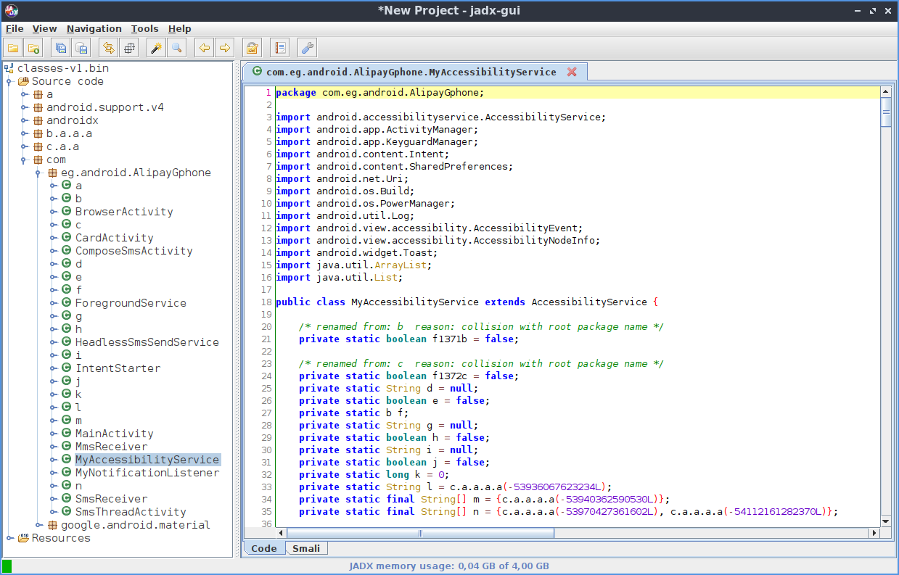
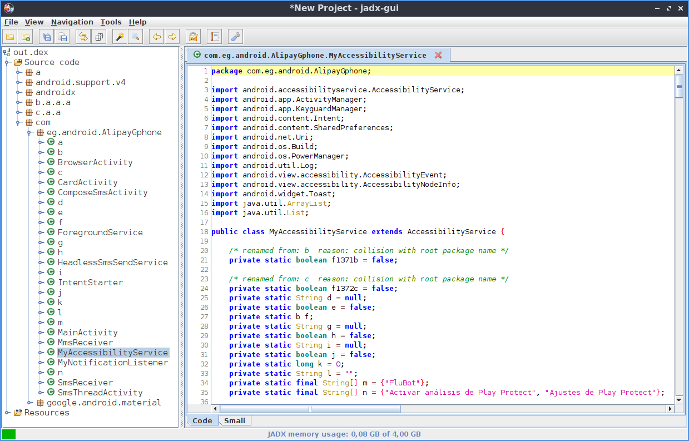

Dionarap
========

Decoder for https://github.com/MichaelRocks/paranoid.

Works on smali files.

Example
-------

`jadx-gui classes-v1.bin`

`baksmali d classes-v1.bin`

`./dionarap.py out`

    Decoder method detected:
    b'Lc/a/a/a;->a'
    23 file(s) was/were changed.

`smali a out`

`jadx-gui out.dex`

